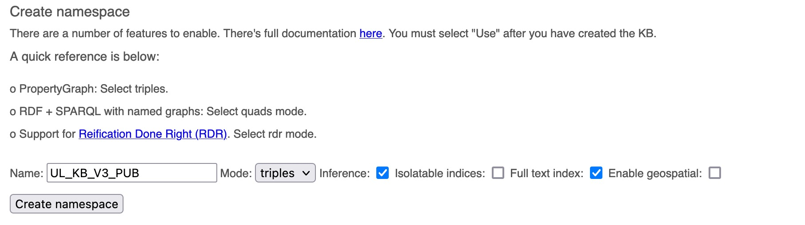
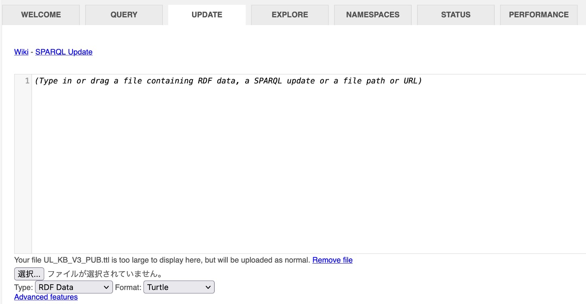
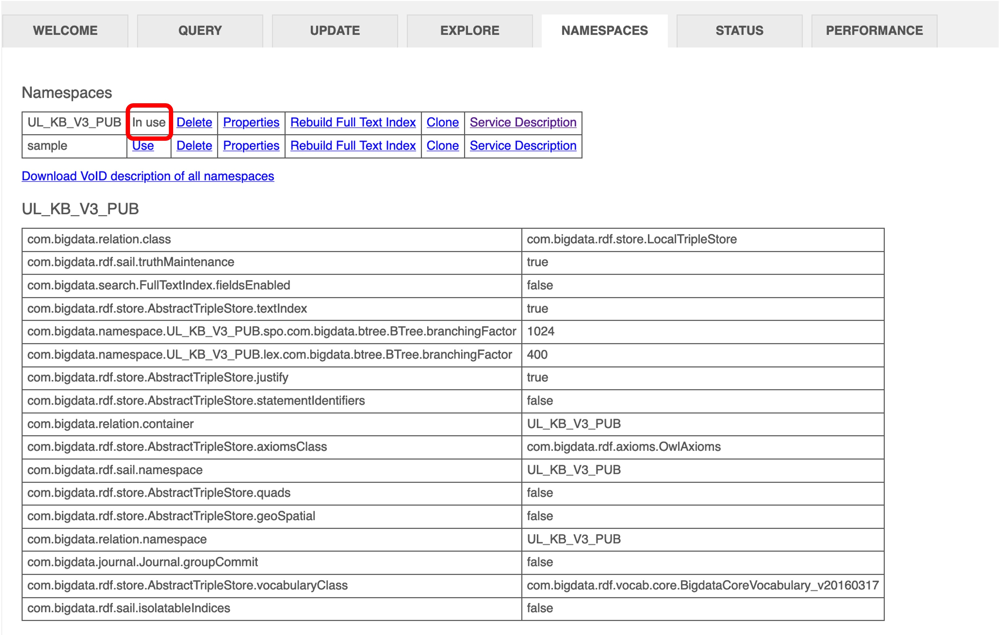

# INSTALLATION: amr-verbnet-semantics

# CUDA

- Supported CUDA 10.2
  - Note: `thinc` gives an error with CUDA 11.
  - <details><summary>Install commands for CUDA 10.2 on Ubuntu 20</summary><div>
  
    ```bash
    # download toolkit from https://developer.nvidia.com/cuda-10.2-download-archive
    # download cudnn from https://developer.nvidia.com/rdp/cudnn-archive#a-collapse830-102
    
    # set gcc-9 priority
    sudo update-alternatives --install /usr/bin/gcc gcc /usr/bin/gcc-9 90
    sudo update-alternatives --install /usr/bin/g++ g++ /usr/bin/g++-9 90
    
    # install gcc-7
    sudo apt-get install gcc-7 g++-7
    sudo update-alternatives --install /usr/bin/gcc gcc /usr/bin/gcc-7 100
    sudo update-alternatives --install /usr/bin/g++ g++ /usr/bin/g++-7 100
    
    # install cuda
    sudo sh cuda_10.2.89_440.33.01_linux.run
   
    # add these paths in .bashrc
    nano ~/.bashrc
    # export LD_LIBRARY_PATH=/usr/local/cuda-10.2/lib64:$LD_LIBRARY_PATH
    # export PATH=/usr/local/cuda-10.2/bin:$PATH
    
    # install cudnn
    sudo dpkg -i cudnn-local-repo-ubuntu1804-8.3.1.22_1.0-1_amd64.deb
   
    # check cuda version
    nvcc --version
     
    # if you want to decrease the priority for gcc-7
    sudo update-alternatives --install /usr/bin/gcc gcc /usr/bin/gcc-7 70
    sudo update-alternatives --install /usr/bin/g++ g++ /usr/bin/g++-7 70
    ```
    </div></details>

## Create virtual environment

```bash
conda create -n amr-verbnet python=3.7
conda activate amr-verbnet
```

## Install dependencies
If we want to visualize the enhanced AMR graph, we need to install the pygraphviz package, which requires installing graphviz first:

```bash
# Using Conda
conda install -c anaconda graphviz
CONDA_HOME=$(which conda); pip install --global-option=build_ext --global-option="-I{$CONDA_HOME}/envs/amr-verbnet/include" --global-option="-L{$CONDA_HOME}/envs/amr-verbnet/lib" --global-option="-R{$CONDA_HOME}/envs/amr-verbnet/lib" pygraphviz

# Ubuntu and Debian
sudo apt-get install graphviz graphviz-dev
pip install pygraphviz

# macOS
brew install graphviz
pip install pygraphviz
```

You can know how to install pygraphviz on other environments with 
[the document](https://pygraphviz.github.io/documentation/stable/install.html).

Next we install our git repository as a standalone python library so that it can be called from other projects. Specifically, it is installed under the project root directory.
```bash
bash scripts/install.sh
```
Note that the scripts/install.sh downloads some NLTK corpora. If you already have some existing corpora under ~/nltk-data, please do backup accordingly.

## Create config file
Note that we use YAML config file to set app specific parameters. To get started, create your own local config file using config_template.yaml file and customize values of different fields if needed and save with name config.yaml.

```bash
cp config_template.yaml config.yaml
nano config.yaml
```

## Setup knowledge base
(1) unzip .ttl.zip file from KG folder for uploading to Blazegraph later.

```bash
unzip KG/UL_KB_V5_PUB.ttl.zip
```

(2) start a database server with the command

```bash
cd blazegraph
java -server -Xmx32g -Djetty.port=9999 -jar blazegraph.jar
```

You can see the server through `http://127.0.0.1:9999/blazegraph/`. 

(3) On the ‘namespaces’ tab, create a new namespace with the name you want, e.g. UL_KB_V5_PUB. Make sure you tick ‘inference’ and ‘full text index’  


(4) On the ‘update’ tab, drag and drop the .ttl file that you downloaded and unzipped in step (1), then click ‘update’.


(5) On the ‘namespaces’ tab, confirm that the namespace you want to use is running. 


(6) set the SPARQL_ENDPOINT address in the config.yaml file, e.g.

```yaml
SPARQL_ENDPOINT: "http://localhost:9999/blazegraph/namespace/UL_KB_V5_PUB"
```

## Download AMR parsing models for local use
Note that the scripts/install.sh creates `third_party` directory to store the AMR models. To use it locally, you have to download the pre-trained model file for AMR from the following path on CCC. Then you have to unzip the file in `third_party` directory. If you use the default values of AMR_MODEL_CHECKPOINT_PATH and THIRD_PARTY_PATH from the config template, you are good to go. Otherwise, set them accordingly.
 
`/dccstor/ykt-parse/SHARED/MODELS/AMR/transition-amr-parser/amr2.0_v0.4.1_youngsuk_ensemble_destillation.zip`

## Set up the PYTHONPATH environment variable
All test python code should be called from the project root directory, which is what the PYTHONPATH environment variable should be set to.

```bash
export PYTHONPATH=.
```

## FLASK server
If you would like to use FLASK to call the parsing as a web service with the advantage of faster response, set the following in the config.yaml file:

```yaml
USE_FLASK: true
```

To start FLASK server, run

```bash
export FLASK_APP=./amr_verbnet_semantics/web_app/__init__.py; python -m flask run --host=0.0.0.0 --port=5000
```

The Flask logs indicate what URL the service is running on.

To test the service, try a test example:

```bash
python amr_verbnet_semantics/test/test_service.py
```

Otherwise set it to false to call the package directly:

```yaml
USE_FLASK: false
```

and then try a test example:

```bash
python amr_verbnet_semantics/test/test_local_amr_client.py
```
